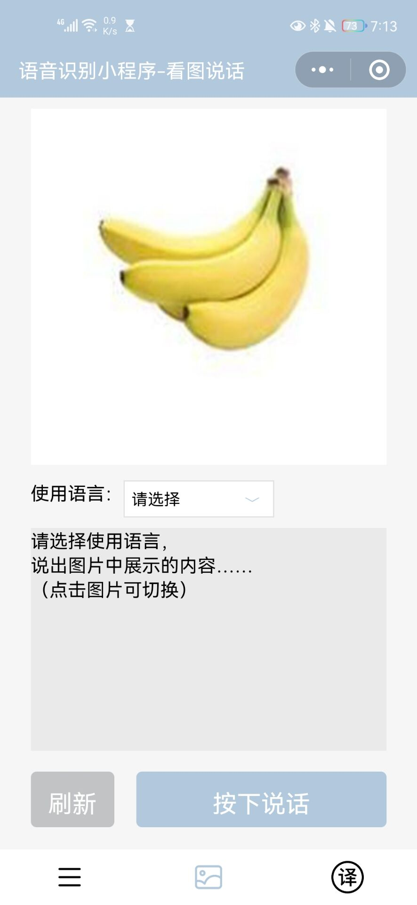

# 语音识别小程序项目报告

# 1 项目背景

项目名称为“语音识别小程序”，目标为以下应用场景提供服务：

1. 看图说话用于辅助训练儿童识别物体；
2. 当写文档或聊天时，不想打字也不想发语音时可以使用即时翻译；
3. 其他需要语音转文字的事情。

# 2 功能介绍

本产品有“看图说话”和“即时翻译”两个功能。

开发环境：微信小程序开发工具+百度云智能平台服务器

## 2.1 看图说话

### 2.1.1 图片选择

点击图片随机切换图片库中的照片，如图2-0、2-1、2-2、2-3、2-4。


图2-0 素材图片库



图2-1


图2-2


图2-3


图2-4

### 2.1.2 语言选择

点击下拉框选择录音将使用的语言，共四个选项，如图2-5。


图2-5

未选择“使用语言”时，点击`按下说话`键出现2s提示：“请选择使用语言！”，如图2-6。


图2-6

### 2.1.3 录音

按下`按下说话`键后开始录音，松手录音结束，如图2-7。


图2-7

### 2.1.4 识别判断

录音键长按松手后，开始处理语音内容，提示“识别判断中”，如图2-8。


图2-8

处理完毕，文本框显示识别结果和判断结果，如图2-9、2-10。


图2-9
语音内容符合图片，
显示“√ 符合图片内容”


图2-10
语音内容不符合图片，
显示“× 不符合图片内容”

### 2.1.5 刷新

点击`刷新`，页面恢复初始状态，如图2-11、2-12。


图2-11 刷新前


图2-12 刷新后

## 2.2 即时翻译

### 2.2.1 翻译设置

点击下拉框选择录音将使用的语言和翻译的目标语言，如图2-13。


图2-13

翻译设置未全部完成时，点击`按下说话`键出现2s提示：“请完成翻译设置！”，如图2-14


图2-14

### 2.2.2 录音

按下`按下说话`键后开始录音，松手录音结束，如图2-15。


图2-15

### 2.2.3 识别翻译

录音键长按松手后，开始处理语音内容，提示“识别翻译中”，如图2-16。


图2-16

处理完毕，原文文本框和译文文本框分别显示识别结果和翻译结果，如图2-17。


图2-17

### 2.2.4 刷新

点击`刷新`，页面恢复初始状态，如图2-18。


图2-18

# 3 界面设计

## 3.1 配色方案

以饱和度偏低的蓝色和灰色为主色系，根据实际UI调整颜色深浅，提高科技感和舒适度，如图3-1~3-7。


图3-1


图3-2


图3-3


图3-4


图3-5


图3-6


图3-7

## 3.2 图标

### 3.2.1 产品LOGO

LOGO图案由代表语音的话筒元素、”自动语音识别“英文文字和代表声波的渐变同心圆组合而成，颜色采用和主色调一致的蓝色系，文字和图形选用白色，实现了功能和美观的统一，如图3-8。


图3-8

### 3.2.2 导航图标

界面底部导航栏三个页面图标采用黑色，选中时切换为蓝色（#B2C8DD），如图3-9~3-14。


图3-9


图3-11


图3-13


图3-10


图3-12


图3-14

图标素材来自Iconfont网站：[https://www.iconfont.cn/](https://www.iconfont.cn/)。

### 3.2.3 小程序图片

小程序图片结合“语音识别”主题，采用麦克风emoji 🎙️与白色背景的结合，突出小程序基本功能，如图3-15、3-16。


图3-15


图3-16

### 3.2.4 下拉框图标

下拉框图标采用蓝色（#B2C8DD）。


图3-17 展开


图3-18 收起

## 3.3 界面逻辑

### 3.3.1 小程序首页

如图3-19，点击LOGO跳转至小程序说明页，点击`看图说话`和`即时翻译`按键分别跳转至相应功能页，同时导航栏也可以实现对应页面跳转。


图3-19 小程序首页

### 3.3.2 看图说话功能页

如图3-20，使用导航栏实现页面跳转。


图3-20 看图说话功能页

### 3.3.3 即时翻译功能页

如图3-21，使用导航栏实现页面跳转。


图3-21 即时翻译功能页

### 3.3.4 小程序说明页

如图3-22，点击LOGO跳转至小程序首页。


图3-22 小程序说明页

# 4 技术开发

语音识别小程序开发主要分为微信小程序端和百度云智能平台服务器端，如图4-1。


图4-1

## 4.1 百度云智能平台服务器端

### 4.1.1 创建应用实例

在百度云智能平台分别创建语音识别、词法分析和文本翻译的应用实例，获取对应的`AccessKey`和`AccessSecret`，如图4-2。


图4-2

### 4.1.2 接口测试

使用POSTMAN工具调试接口的连通性。

采用`AccessKey`+`AccessSecret`的模式进行接口鉴权，向服务器发送POST请求，从响应数据中获取`AccessToken`，如图4-3。


图4-3

使用获取到的`AccessToken`，编辑附有pcm测试文件的POST请求，从服务器响应数据中得到对测试音频文件的识别结果“北京科技馆”。其中请求需要填写语言编码`dev_pid`、用户唯一标识`cuid`和`token`，Headers中注明`Content-Type: audio/pcm;rate=16000`，如图4-4。


图4-4

### 4.1.3 监测接口调用情况

在百度云智能平台上监测应用接口的调用情况。


图4-5

## 4.2 微信小程序端

### 4.2.1 刷新键

```jsx
//刷新
RefreshPage(){
    wx.reLaunch({
      url: 'page_photo'
    })
  }
```

### 4.2.2 下拉框

```jsx
// Componet/Componet.js
Component({
  /**
   * 组件的属性列表
   */
    properties: {
        propArray:{
            type:Array,
        }
    },
  /**
   * 组件的初始数据
   */
    data: {
        selectShow:false,//初始option不显示
        nowText:"请选择",//初始内容
        animationData:{}//右边箭头的动画
    },
  /**
   * 组件的方法列表
   */
    methods: {
　　　//option的显示与否
        selectToggle:function(){
            var nowShow=this.data.selectShow;//获取当前option显示的状态
            //创建动画
            var animation = wx.createAnimation({
                timingFunction:"ease"
            })
            this.animation=animation;
            if(nowShow){
                animation.rotate(0).step();
                this.setData({
                    animationData: animation.export()
                })
            }else{
                animation.rotate(180).step();                
                this.setData({
                    animationData: animation.export()
                })
            }
            this.setData({
                selectShow: !nowShow
            })
        },
        //设置内容
        setText:function(e){
            var nowData = this.properties.propArray;//当前option的数据是引入组件的页面传过来的，所以这里获取数据只有通过this.properties
            var nowIdx = e.target.dataset.index;//当前点击的索引
            var nowText = nowData[nowIdx].text;//当前点击的内容
            //再次执行动画，注意这里一定，一定，一定是this.animation来使用动画
            this.animation.rotate(0).step();
            this.setData({
                selectShow: false,
                nowText:nowText,
                animationData: this.animation.export()
            });

            var pho_getphosrcl={
                id:nowIdx,
                lan:nowText
            }
            this.triggerEvent('select-getphosrcl', pho_getphosrcl);
            var trans_getsrcl={
                id: nowIdx,
                lan: nowText
            }
            this.triggerEvent('select-getsrcl', trans_getsrcl);
            var trans_getdstl={
                id: nowIdx,
                lan: nowText
            }
            this.triggerEvent('select-getdstl', trans_getdstl)
        }
    }
})
```

```jsx
GetphoSrcl: function(e){
    //console.log(e.detail.lan);
    flag = 1;
    for (var i in localData.dataList3){
      if (e.detail.lan == localData.dataList3[i].text){
        devpidlan = localData.dataList3[i].lcode;
        //console.log(devpidlan);
        break;
      }
    }
  },
```

```jsx
GetSrcl: function(e){
    flag1 = 1;
    for (var i in localData.dataList2){
      if (e.detail.lan == localData.dataList2[i].text){
        src_devpidlan = localData.dataList2[i].lcode;
        break;
      }
    };
    for (var i in localData.dataList1){
      if (e.detail.lan == localData.dataList1[i].text){
        //console.log(localData.dataList1[i].lcode);
        src_lan = localData.dataList1[i].lcode;
        break;
      }
    }
  },
  GetDstl: function(e){
    flag2 = 1;
    for (var i in localData.dataList1){
      if (e.detail.lan == localData.dataList1[i].text){
        //console.log(localData.dataList1[i].lcode);
        dst_lan = localData.dataList1[i].lcode;
        break;
      }
    }
  },
```

### 4.2.3 录音键

```jsx
SoundRecognize(){
    SR_Result(this.audio_data,devpidlan).then(res=>{
      console.log(res);
      this.setData({
        RecognizeResult_photo: '识别结果为：' + res
      });
      NLP_Result(res).then(res=>{
        //console.log(res);
        var Nset=new Array();
        var i;
        for(i=0;i<res.items.length;i++)
        {
            if(res.items[i].pos="n"){
                Nset.push(res.items[i].item)
            }
        };
        var Newdata=pastdata.postdata.lists[Golbal_index-1].value;
        //console.log("依据值:"+Newdata);
        wx.hideLoading();
        //flagE = 0;
        for(i=0;i<Nset.length;i++)
        {
            if(Newdata==Nset[i]){
            this.setData({
                JudgeResult:'判断结果: √ 符合图片内容'
            });
            break;
            }
        }
        if(i==Nset.length)
        {
            this.setData({
                JudgeResult:'判断结果: × 不符合图片内容'
            });
        }
        }
    )});
  },

  //录音键按下函数
  BtnStart(){ 
    if (flag == 0){
      wx.showToast({
        title: '请选择使用语言!',
        icon:'error',
        duration: 2000
      });
    }
    else{
      this.setData({phobtntext:'倾听中，松手结束'});
      const options = {
        sampleRate: 16000,
        numberOfChannels: 1,
        format: "PCM"
      };
      recorder.start(options);
      recorder.onStart(()=>{
        console.log("Recording Start!");
      });
      recorder.onError(err=>{
        console.log(err);
      });
    }
  },

  //录音键松开函数
  BtnStop(){
    if (flag == 1){
      wx.showLoading({
        title: '识别判断中',
        duration: 10000
      });
      this.setData({phobtntext:'按下说话'});
      recorder.stop();
      recorder.onStop(res=>{
        console.log(res);
        this.audio_path = res.tempFilePath;
        const fs = wx.getFileSystemManager();
        fs.readFile({
          filePath: this.audio_path,
          success: (res)=>{
            this.audio_data = res.data;
            this.SoundRecognize();
          }
        });
      });
    }
  },
```

```jsx
SoundRecognize(){
    SR_Result(this.audio_data,src_devpidlan).then(res=>{
      console.log(res);
      this.setData({
        RecognizeResult_trans: '识别结果为：' + res
      });
      TRANSLATION_Result(res,src_lan,dst_lan).then(res=>{
        wx.hideLoading();
        console.log(res);
        this.setData({
          TranslationResult_trans: '翻译结果为：' + res
        })
      })
    });
  },

  //录音键按下函数
  BtnStart(){ 
    if (flag1 == 0 || flag2 == 0){
      wx.showToast({
        title: '请完成翻译设置!',
        icon:'error',
        duration: 2000
      });
    }
    else{
      this.setData({transbtntext:'倾听中，松手结束'});
      const options = {
        sampleRate: 16000,
        numberOfChannels: 1,
        format: "PCM"
      };
      recorder.start(options);
      recorder.onStart(()=>{
        console.log("Recording Start!");
      });
      recorder.onError(err=>{
        console.log(err);
      });
    }
  },

  //录音键松开函数
  BtnStop(){
    if (flag1 == 1 && flag2 == 1){
      wx.showLoading({
        title: '识别翻译中',
        duration: 10000
      });
      this.setData({transbtntext:'按下说话'});
      recorder.stop();
      recorder.onStop(res=>{
        console.log(res);
        this.audio_path = res.tempFilePath;
        const fs = wx.getFileSystemManager();
        fs.readFile({
          filePath: this.audio_path,
          success: (res)=>{
            this.audio_data = res.data;
            this.SoundRecognize();
          }
        });
      });
    }
  },
```

### 4.2.4 GetToken

```jsx
//百度智能云中创建语音识别应用sr_baidu_1，获取APIKey1和SecretKey1
const ACCESS_KEY1 = "4A64Tc2LbFFZnnlzQGI9jImx";
const ACCESS_SECRET1 = "CPrelm1DZxkitvxnLKvb0ULk1Q6bpvHy";
//百度智能云中创建文本翻译应用sr_baidu_2，获取APIKey2和SecretKey2
const ACCESS_KEY2 = "GNdY9nQEkiChsjoYbkMavyb1";
const ACCESS_SECRET2 = "tqolhx3y7kFSpb5MchLK0YPBduYKvwbd";
//百度智能云中创建NLP应用sr_baidu_3，获取APIKey3和SecretKey3
const ACCESS_KEY3 = "pqyHCqugGfZvouhQdvvbpE6Z";
const ACCESS_SECRET3 = "WT1uxmCZM6LIpluC006qcdPytYBMdPU4";

//获得百度AI语音识别的Token
export function GetToken1(){
  return new Promise((resolve,reject)=>{
    wx.request({
      url: `https://openapi.baidu.com/oauth/2.0/token?grant_type=client_credentials&client_id=${ACCESS_KEY1}&client_secret=${ACCESS_SECRET1}`,
      method: "POST",
      success: (res)=>{
        wx.setStorage({
          data: res.data.refresh_token,
          key: "user-token1",
        })
      }
    });
  });
}

//获得百度//获得百度AI文本翻译的Token
export function GetToken2(){
  return new Promise((resolve,reject)=>{
    wx.request({
      url: `https://openapi.baidu.com/oauth/2.0/token?grant_type=client_credentials&client_id=${ACCESS_KEY2}&client_secret=${ACCESS_SECRET2}`,
      method: "POST",
      success: (res)=>{
        wx.setStorage({
          data: res.data.access_token,
          key: "user-token2",
        })
      }
    });
  });
}

export function GetToken3(){
    return new Promise((resolve,reject)=>{
      wx.request({
        url: `https://aip.baidubce.com/oauth/2.0/token?grant_type=client_credentials&client_id=${ACCESS_KEY3}&client_secret=${ACCESS_SECRET3}`,
        method: "POST",
        success: (res)=>{
          // console.log("token!");
          wx.setStorage({
            data: res.data.access_token,
            key: "user-token3",
          })
        }
      });
  });
}
```

### 4.2.5 调用请求

```jsx
//调用百度AI语音识别接口，获得语音识别结果
export function SR_Result(data,devpidlan){
  let token = wx.getStorageSync("user-token1");
  if(!token){
    console.log("reget token");
    GetToken1();
  }
  return new Promise((resolve, regest)=>{
    wx.request({
      url: `https://vop.baidu.com/server_api?dev_pid=${devpidlan}&cuid=155236miniapp&token=${token}`,
      method: "POST",
      data: data,
      header: {"Content-Type": "audio/pcm;rate=16000"},
      success: (res)=>{
        resolve(res.data.result[0]);
      },
      fail: regest
      //fail: resolve('1ERROR1')
    })
  });
}

//调用百度AI文本翻译接口，获得翻译结果
export function TRANSLATION_Result(data,srclan,dstlan){
  let token = wx.getStorageSync("user-token2");
  if(!token){
    console.log("reget token");
    GetToken2();
  }
  return new Promise((resolve, regest)=>{
    wx.request({
      url: `https://aip.baidubce.com/rpc/2.0/mt/texttrans/v1?access_token=${token}&q=${data}&from=${srclan}&to=${dstlan}`,
      method: "POST",
      header: {"Content-Type": "application/json"},
      success: (res)=>{
        console.log(res);
        if (res.data && res.data.result.trans_result) {
          resolve(res.data.result.trans_result[0].dst);
        }
      },
      fail: regest
      //fail: resolve('1ERROR1')
    })
  });
}

  //调用百度NLP接口，获得翻译结果
  export function NLP_Result(data){
    let token = wx.getStorageSync("user-token3");
    if(!token){
      console.log("reget token");
      GetToken3();
    }
    return new Promise((resolve, regest)=>{
      wx.request({
        url: `https://aip.baidubce.com/rpc/2.0/nlp/v1/lexer?charset=UTF-8&access_token=${token}`,
        method: "POST",
        data:{
            "text": data
        },
        header: {"Content-Type": "application/json"},
        success: (res)=>{
          console.log(res.data);
          resolve(res.data);
        },
        fail: regest
        //fail: resolve('1ERROR1') 
      })
    });
  }
```

# 5 改进发展

1. 服务器连接有时受网络影响较为不稳定造成小程序卡顿；
2. 由于服务器识别音频格式受限，未来考虑通过各类格式转换的算法增加用户上传音频文件的“即时翻译“功能；
3. 增加图像识别算法允许用户上传图像集或介入网络图像集进行“看图说话”；
4. 采用更为复杂的自然语言处理算法以识别更长的描述文字和图片的匹配性；
5. 扩展其他和语音识别有关的功能。

# 6 ASR学习报告

## 6.1 语音识别定义及流程

### 6.1.1 定义

语音识别技术是指让机器通过识别和理解把语音信号转变为相应的文本或命令的高科技技术，广泛应用于工业、家电、通信、汽车电子、医疗、家庭服务、消费电子产品等各个领域。

### 6.1.2 流程


图6-1

 待识别语音经话筒转化为电信号后加在识别系统的输入端。经过预处理。接着进行语音特征提取。用反映语音信号特征的若干參数来代表原始语音。经常使用的语音特征包含：线性预测系数（LPC）、线性预测倒谱系数（LPCC）、Mel频谱系数（MFCC）等**。**接下来分为两个阶段：训练阶段和识别阶段。

在训练阶段，对用特征參数形式表示的语音信号进行相应处理，获得表示识别基本单元共性特点的标准数据，以此构成參考模板，将全部能识别的基本单元的參考模板结合在一起。形成參考模式库。在识别阶段，将待识别的语音信号经特征提取后逐一与參考模式库中的各个模板按某种原则进行匹配。找出最相似的參考模板所相应的发音，即为识别结果。最后进行语音处理，涉及语法分析、语音理解、语义网络等。

语音识别过程要依据模式匹配原则，计算未知语音模式与语音模板库中的每个模板的距离测度，从而得到最佳的匹配模式。语音识别所应用的模式匹配方法主要有动态时间规整（Dynamic Time Warping，DTW），隐马尔科夫模型（Hidden Markov Model，HMM）和人工神经元网络（Artificial Neural Networks，ANN）。

## 6.2 特征提取——提取 MFCC 和 FBank 特征

### 6.2.1 简介

人耳对声音频谱的响应是非线性的，Fbank以类似于人耳的方式对音频进行处理，可以提高语音识别的性能。获得语音信号的fbank特征的一般步骤是：预加重、分帧、加窗、离散傅里叶变(DFT)、mel滤波、去均值等。对FBank做离散余弦变换（DCT）即可获得MFCC特征。

### 6.2.2 特征提取过程


图6-2

①**预加重**：预加重是一阶高通滤波器，可以提高信号高频部分的能量。
②**分帧**：为减少语音信号整体的非稳态、时变的影响，从而对语音信号进行分段处理，其中每一段称为一帧。
③**加窗**：加窗主要是为了使时域信号似乎更好地满足 FFT 处理的周期性要求，减少泄漏。
④**DFT**：离散傅里叶变换（Discrete Fourier Transform，缩写为 DFT），将每个窗口内的数据从时域信号转为频域信号。
⑤**梅尔滤波器组**：梅尔刻度（Mel Scale）是一种非线性刻度单位，表示人耳对音高（pitch）变化的感官，基于频率定义。
在 Mel 频域内，人的感知能力为线性关系。
⑥**DCT**：离散余弦变换具有很强的"能量集中"特性：大多数的自然信号（包括声音和图像）的能量都集中在离散余弦变换后的低频部分，实际就是对每帧数据在进行一次降维。

## 6.3 隐马尔可夫模型（HMM）

### 6.3.1 简介

隐马尔可夫模型是一个关于时序的概率模型，它描述了一个由隐藏的马尔可夫链生成状态序列，再由状态序列生成观测序列的过程。其中，状态之间的转换以及观测序列和状态序列之间都存在一定的概率关系。隐马尔可夫模型主要用来对上述过程进行建模。

### 6.3.2 三大要素

隐马尔可夫模型主要有三大要素，分别是：初始状态向量(π)，状态转移概率矩阵A和观测概率矩阵B。此三大要素决定了一个模型，且在模型的训练过程中一直保持不变。模型可表示为：

                                                                        λ=(A,B,π)

①初始状态向量 π。它决定了模型在最开始时每个状态的概率。若有N个状态，则初试状态向量的长度为N，

其中


表示状态i作为初始状态的概率，所有的概率之和为1。

②状态转移概率矩阵A。此矩阵主要描述了不同状态之间的转移概率。由于共有N个状态，则状态转移概率矩阵的大小为N*N。


其中


表示状态i直接转移到状态j的概率。并且，状态转移概率矩阵的每一行的概率之和为1。

③观测概率矩阵B。表示由状态生成观测的概率。其符号表示为：


其中


表示由状态j生成观测k的概率。同样，矩阵的每一行的概率之和为1。

### 6.3.3 三大假设

①**齐次马尔可夫假设**。又叫一阶马尔可夫假设，即任意时刻的状态只依赖前一时刻的状态，与其他时刻无关。

推广：n阶马儿可夫模型：任意时刻的状态只依赖前面n个时刻的状态，与其他时刻无关。
②**观测独立性假设**。任意时刻的观测只依赖于该时刻的状态，与其他状态无关。
③**参数不变性假设**。上面介绍的三大要素不随时间的变化而改变，即在整个训练过程中一直保持不变。

### 6.3.4 三大问题

①**概率计算问题**：主要是在已知模型参数的条件下，求给定观测序列出现的概率

暴力计算法 --> 时间复杂度：


前向算法 --> 时间复杂度：


后向算法 --> 时间复杂度：


②**预测问题**：已知模型参数和观测序列，求观测序列对应的最可能的状态序列

近似算法 --> 贪心的思想 --> 局部最优

维特比算法 –> 动态规划
③**学习问题**：已知观测序列，估计模型参数

监督学习法 --> 给出观测序列+对应的状态序列 --> 极大似然估计

非监督学习法 --> 只有观测序列，无相应的状态序列 --> 前向后向算法

## 6.4 动态时间规整：(Dynamic Time Warping，DTW)

### 6.4.1 定义

用于比较不同长度的两个数组或时间序列之间的相似性或计算两者间的距离。

DTW(dynamic time warping)的思想是：由于语音信号是一种具有相当大随机性的信号，即使相同说话者对相同的词，每一次发音的结果都是不同的，也不可能具有完全相同的时间长度。因此在与已存储模型相匹配时，未知单词的时间轴要不均匀地扭曲或弯折，以使其特征与模板特征对正。用时间规整手段对正是一种非常有力的措施，对提高系统的识别精度非常有效。动态时间规整DTW是一个典型的优化问题，它用满足一定条件的的时间规整函数W(n)描述输入模板和参考模板的时间对应关系，求解两模板匹配时累计距离最小所对应的规整函数。

### 6.4.2 满足的规则

DTW是计算给定两个序列最优匹配的一种方法，满足以下规则：

①第一个序列的每个索引必须与另一序列的一个或多个索引匹配，反之亦然 。
②第一个序列的第一个索引必须匹配另一个序列的第一个索引(也可匹配多个索引)。
③第一个序列索引对另一个序列索引的映射必须是单调递增的，反之亦然。

总而言之，头和尾必须在位置上匹配，不能交叉匹配，也不能遗漏。

### 6.4.3 算法原理

DTW算法的步骤：

①计算两个序列各个点之间的距离矩阵。

②寻找一条从矩阵左上角到右下角的路径，使得路径上的元素和最小(称路径上的元素和为路径长度)。

矩阵从左上角到右下角的路径长度有以下性质：

①当前路径长度 = 前一步的路径长度 + 当前元素的大小

②路径上的某个元素(i,j)，它的前一个元素只可能为以下三者之一：

a) 左边的相邻元素 (i, j-1)

b) 上面的相邻元素 (i-1, j)

c) 左上方的相邻元素 (i-1, j-1)

假设矩阵为M，从矩阵左上角（1,1)到任一点(i,j)的最短路径长度为Lmin(i,j)。那么可以用递归算法求最短路径长度：

起始条件：Lmin(1,1)=M(1,1)

当前元素的最短路径必然是从前一个元素的最短路径的长度加上当前元素的值。前一个元素有三个可能，我们取三个可能之中路径最短的那个即可，因此递推规则为：

                              Lmin(i,j)=min(Lmin(i,j-1),Lmin(i-1,j),Lmin(i-1,j-1))+M(i,j)

# 7 项目结构

└─miniprogram ├─apis //百度API接口 ├─component │ └─select ├─images │ └─images1 └─pages ├─index //小程序首页 ├─page_about //小程序说明页 ├─page_photo //看图说话功能页 └─page_trans //即时翻译功能页

# 8 参考资料

1. [https://blog.csdn.net/qq_41122414/article/details/113805835](https://blog.csdn.net/qq_41122414/article/details/113805835)
2. [https://blog.csdn.net/qq_41122414/article/details/113806396](https://blog.csdn.net/qq_41122414/article/details/113806396)
3. [http://blog.csdn.net/itplus/article/details/15335811](http://blog.csdn.net/itplus/article/details/15335811)
4. [http://www.cnblogs.com/kaituorensheng/archive/2012/12/06/2806263.html](http://www.cnblogs.com/kaituorensheng/archive/2012/12/06/2806263.html)
5. [https://en.wikipedia.org/wiki/Dynamic_time_warping](https://en.wikipedia.org/wiki/Dynamic_time_warping)